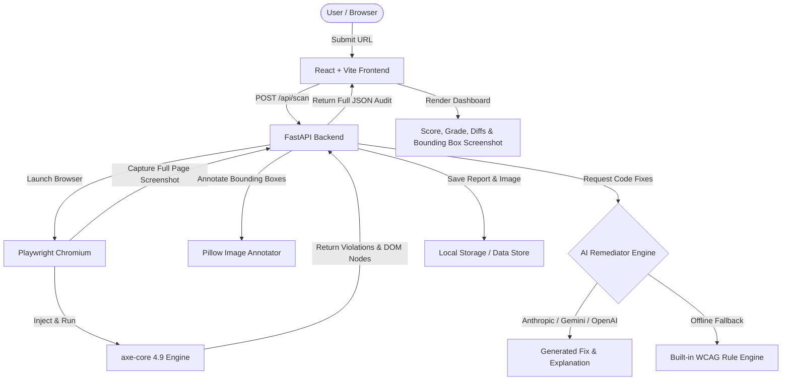

# 🛡️ AI Accessibility Auditor

> An end-to-end automated **WCAG 2.1 (Level A & AA)** web accessibility auditing platform powered by **Playwright**, **axe-core**, and multi-model **LLM Remediators** (Claude 3.5 Sonnet, Gemini 1.5, GPT-4o) with visual bounding box screenshot annotations.

[](https://github.com/anjum-azra)
[](LICENSE)
[](https://www.python.org/)
[](https://fastapi.tiangolo.com/)
[](https://react.dev/)
[](https://vitejs.dev/)
[](https://playwright.dev/)
[](https://github.com/dequelabs/axe-core)
[](https://ai-auditor-pbrg.onrender.com)
---

## 🌟 Key Features

- ⚡ **Automated WCAG 2.1 Audit Engine**: Uses headless Chromium via Playwright and embedded `axe-core` to inspect dynamic JavaScript web applications, single-page apps (SPAs), and static sites.
- 🎨 **Visual Bounding Box Annotations**: Generates full-page PNG screenshots featuring color-coded bounding boxes mapped directly to offending DOM element coordinates (Critical, Serious, Moderate, Minor).
- 🧠 **AI Code Remediator & HTML Diffs**:
  - Translates cryptic WCAG rules into plain-English explanations and screen-reader impact summaries.
  - Generates side-by-side production-ready corrected HTML code diffs.
  - Powered by Anthropic Claude 3.5 Sonnet, Google Gemini 1.5, or OpenAI GPT-4o with an intelligent rule-based offline fallback engine.
- 📊 **Compliance Scorecard & A–F Grading**: Calculates a weighted 0–100 accessibility score and letter grade based on violation severity counts.
- 💻 **Modern Glassmorphic React UI**: Dark/Light mode, live scan progress indicators, interactive side-by-side code diff viewer, violation filters, audit history comparison, and JSON/screenshot export.
- 🐳 **Docker & Cloud Ready**: Multi-stage Docker containerization built for instant deployment to Render, Railway, Fly.io, or self-hosted VPS.

---

## 🏗️ Architecture Overview



---

## 🚀 Quick Start (Local Development)

### Prerequisites

- **Python**: 3.11 or higher
- **Node.js**: 20.x or higher
- **Git**

### 1. Clone the Repository

```bash
git clone https://github.com/anjum-azra/AI-AUDITOR.git
cd AI-AUDITOR
```

### 2. Backend Setup

```bash
# Navigate to backend directory
cd backend

# Create virtual environment
python -m venv venv
source venv/bin/activate  # On Windows: venv\Scripts\activate

# Install Python dependencies
pip install -r requirements.txt

# Install Playwright Chromium browser
playwright install chromium
```

### 3. Configure Environment Variables

Copy `.env.example` to `.env` inside `backend/` or root directory:

```bash
cp .env.example .env
```

Edit `.env` to supply optional AI LLM API keys:

```env
PORT=8000
ANTHROPIC_API_KEY=your_anthropic_api_key
GEMINI_API_KEY=your_gemini_api_key
OPENAI_API_KEY=your_openai_api_key
```

> **Note**: If no API keys are provided, the application automatically uses its built-in rule-based fallback generator for remediation code snippets!

### 4. Run the Backend API Server

```bash
python main.py
```
The FastAPI backend will start at `http://localhost:8000`.

### 5. Frontend Setup

In a new terminal window:

```bash
cd frontend
npm install
npm run dev
```
The React frontend dev server will launch at `http://localhost:5173`.

---

## 🐳 Docker Deployment (Recommended)

You can run the entire application (Backend + Frontend) inside a single multi-stage Docker container:

```bash
# Build the Docker image
docker build -t ai-accessibility-auditor .

# Run the container
docker run -d -p 8000:8000 \
  -e ANTHROPIC_API_KEY="your_key_here" \
  --name ai_auditor \
  ai-accessibility-auditor
```

Access the app in your browser at `http://localhost:8000`.

### Or using Docker Compose:

```bash
docker-compose up -d --build
```

---

## ☁️ Deployment Guide

### Deploying to Render.com

This repository includes a pre-configured [`render.yaml`](file:///c:/Users/DELL/Desktop/AI-AUDITOR/render.yaml) specification:

1. Push code to GitHub (`.gitignore` protects your API keys automatically).
2. Log into [Render.com](https://render.com) and click **New +** -> **Web Service**.
3. Connect your GitHub repository.
4. Render detects the [`Dockerfile`](file:///c:/Users/DELL/Desktop/AI-AUDITOR/Dockerfile) automatically.
5. Set your secret API keys (`ANTHROPIC_API_KEY`, `GEMINI_API_KEY`, etc.) in the Render Environment Variables tab.
6. Deploy!

---

## 📡 API Reference

### `POST /api/scan`
Triggers an automated accessibility scan for a given web URL.

**Request Body**:
```json
{
  "url": "https://example.com",
  "api_key": "optional_override_key",
  "viewport_width": 1280,
  "viewport_height": 800
}
```

**Response**:
```json
{
  "id": "3d5fa6ff",
  "url": "https://example.com",
  "score": 85.0,
  "grade": "B",
  "grade_label": "Good - Minor Accessibility Deficiencies",
  "total_violations": 4,
  "violations": [
    {
      "rule_id": "image-alt",
      "impact": "critical",
      "help": "Images must have alternate text",
      "target_selector": "img#hero-banner",
      "bounding_box": { "x": 120, "y": 45, "width": 800, "height": 300 },
      "ai_fix": {
        "plain_english_explanation": "Image missing alt description...",
        "why_it_matters": "Screen readers announcement...",
        "corrected_code": "",
        "remediation_steps": ["Add descriptive alt attribute"]
      }
    }
  ]
}
```

### `GET /api/report/{id}`
Returns full stored audit report payload by scan ID.

### `GET /api/report/{id}/screenshot`
Returns PNG visual bounding box annotated screenshot for the report.

### `GET /api/reports`
Lists all recent scan reports in history.

---

## 📁 Repository Structure

```
AI-AUDITOR/
├── backend/
│   ├── data/                 # Stored report JSONs & annotated PNG screenshots
│   ├── fix_generator.py      # LLM Remediator (Claude / Gemini / OpenAI + Fallback)
│   ├── main.py               # FastAPI application endpoints & static server
│   ├── scanner.py            # Playwright + axe-core automation script
│   ├── scoring.py            # WCAG Score & Grade calculation logic
│   ├── screenshot.py         # Pillow visual bounding box drawer
│   ├── storage.py            # JSON/PNG file persistency manager
│   └── requirements.txt      # Python dependencies
├── frontend/
│   ├── src/
│   │   ├── components/       # CodeDiffViewer, ReportView, UrlForm, etc.
│   │   ├── App.jsx           # Main React Dashboard
│   │   └── index.css         # Tailwind & custom CSS variables
│   ├── package.json          # Node dependencies
│   └── vite.config.js        # Vite dev server configuration
├── .gitignore                # Git exclusion configuration
├── .env.example              # Environment variable template
├── Dockerfile                # Multi-stage production container build
├── docker-compose.yml        # Docker Compose configuration
└── render.yaml               # Render Cloud Deployment Blueprint
```

---

## 📄 License

This project is licensed under the [MIT License](LICENSE).

---

## 👤 Author

**Anjum**
- GitHub: [@anjum-azra](https://github.com/anjum-azra)

